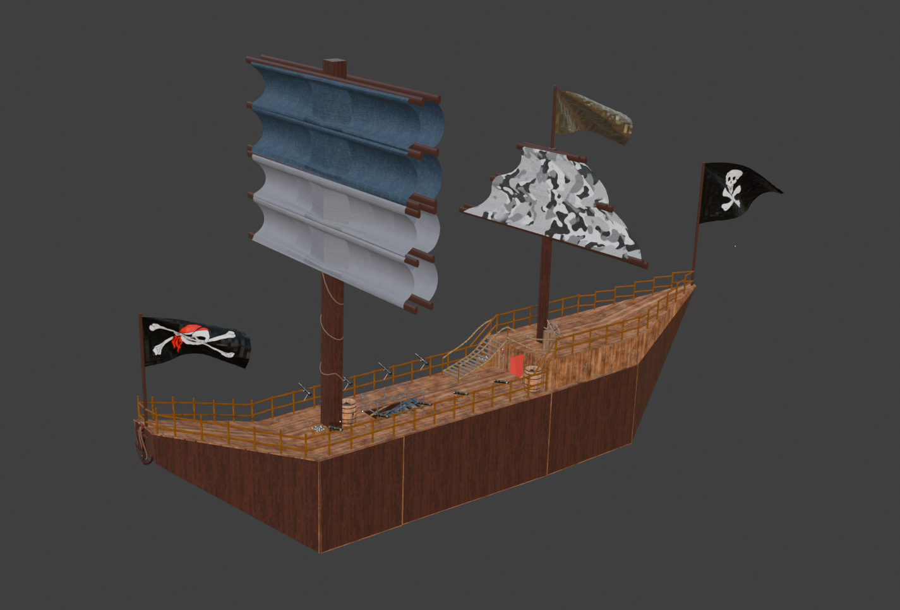
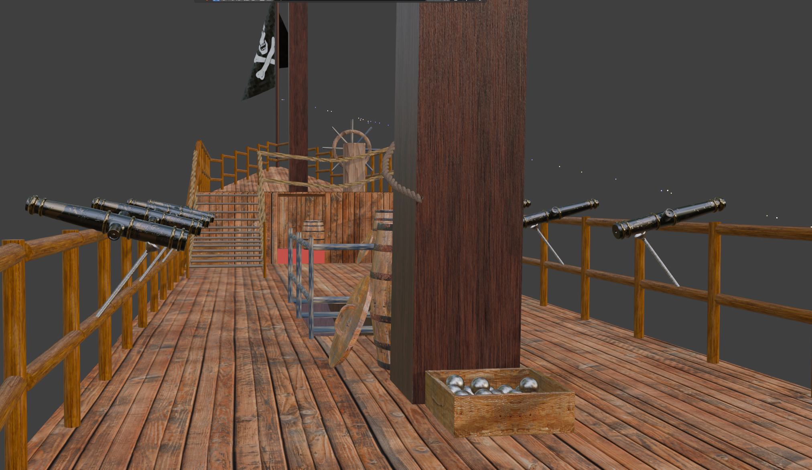
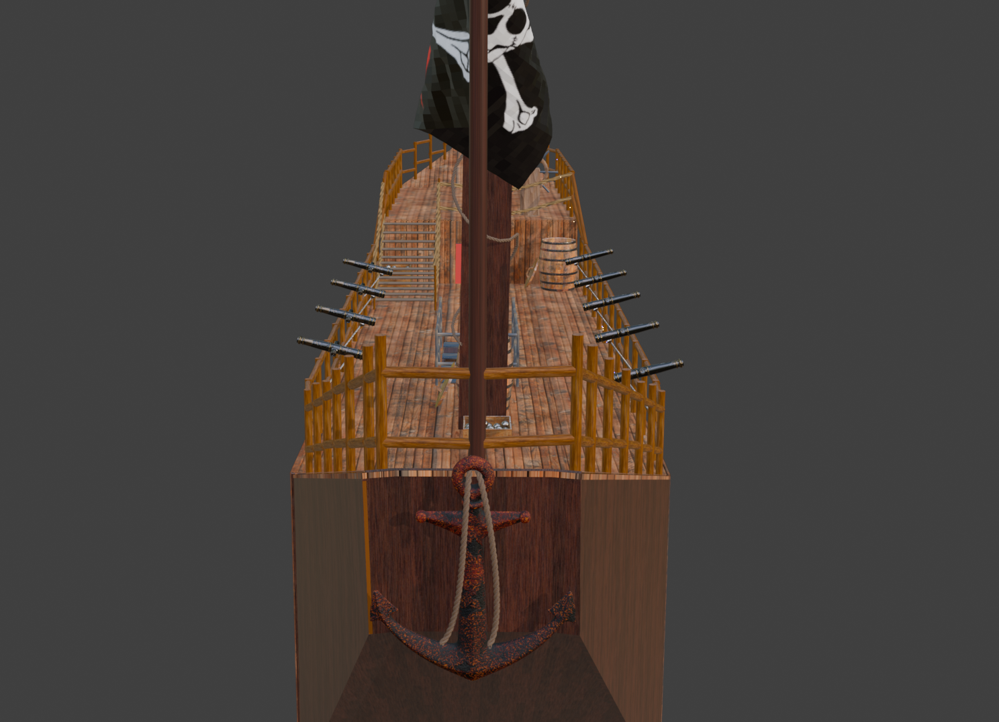

# 🏴‍☠️ Pirate Ship 3D Model – First Project

This is my **first complete 3D pirate ship project**, built using **Blender**.  
It includes exterior details, decks, lower deck, anchor, stairs, railings, ropes, and props like barrels and cannonballs.

> ⚠️ **Note:** This is my first 3D modeling project. Some parts may not be perfectly accurate or optimized, but it was a great learning experience!

---

## 🛠 Features

- **🚢 Exterior** – Hull, mast, and ropes for realism
- **🪜 Deck & Stairs** – Upper deck with railing, stairs leading to lower deck
- **💎 Lower Deck** – Treasure area with supporting columns
- **⚓ Anchor** – Basic anchor at the front
- **🪵 Props** – Barrels, crates, cannonballs, ropes
- **🎨 First-Time Modeling** – Used some free Blender kits as reference and for practice

---

## 📸 Screenshots

### Exterior

### Upper Deck
  

### Anchor

### Lower Deck
  

---

## 🛠 Tools & Credits

- **Blender** – Free modeling software
- Some objects/props referenced from **free Blender kits**  
- Modeled and textured manually for stairs, decks, railings, ropes, and props

---

## 📝 Notes

- Parts may not be perfectly accurate or fully optimized
- Topology might be uneven in some areas
- Some proportions might not be realistic
- This project is primarily for learning and first-time modeling experience

---

## 📂 Repository Structure

- `PirateShip.blend` – Blender file (too large for GitHub, download externally)
- Images: `extirior.png`, `deck1.png`, `deck.png`, `anchor.png`, `lower_deck.png`, `lower_deck1.png`

> ⚡ Download the full Blender/FBX file [here](https://drive.google.com/file/d/1rFhxRZALCyc3Y_Lq9XIlVwIDxKNAZHXn/view?usp=sharing)

---

> ⚡ This project is a first step into 3D modeling. Feedback is welcome!
